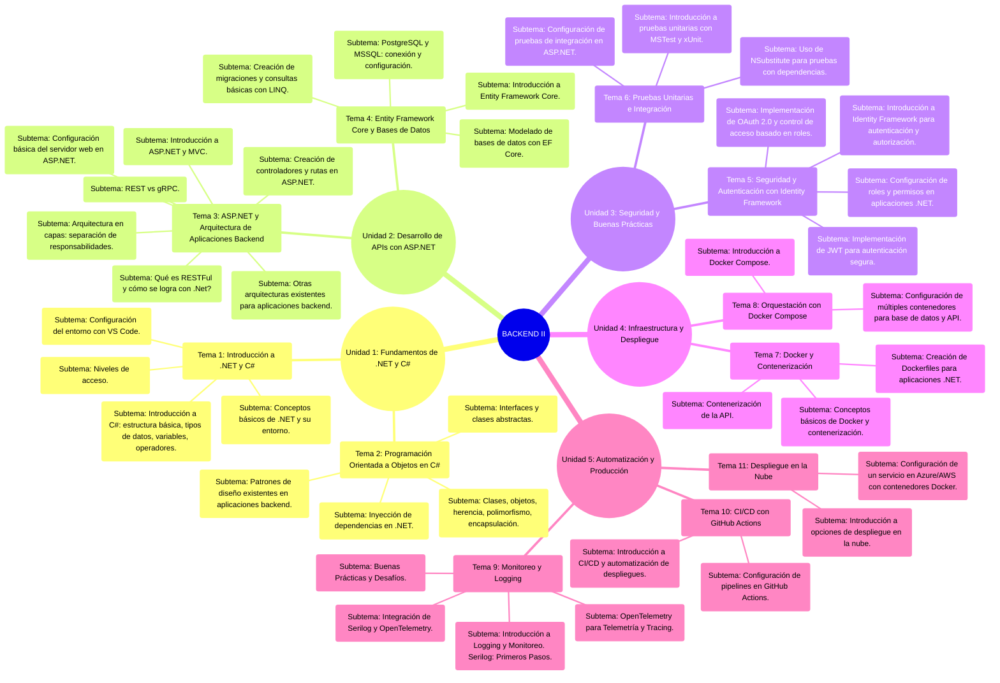

# Presentación del módulo

> [Back to Menu](../README.md)

Este módulo tiene como objetivo introducir a los estudiantes en la programación utilizando el ecosistema .NET y el lenguaje C#. A lo largo del módulo, los estudiantes adquirirán una comprensión más sólida de los fundamentos de programación, el desarrollo de aplicaciones backend con .NET y .NET Core, el uso de bases de datos con Entity Framework Core, y las mejores prácticas en seguridad, pruebas y un abre bocas a despliegues en la nube. 

## ¿Cuál es la competencia que obtiene el estudiante al finalizar el módulo? 

Los participantes desarrollarán las habilidades necesarias para construir aplicaciones modernas y escalables, alineadas con los estándares de la industria. 

#### **Al finalizar el módulo, los estudiantes serán capaces de:**

* Comprender los principios fundamentales de la programación en C# y el entorno .NET.
* Diseñar e implementar aplicaciones utilizando Programación Orientada a Objetos (POO).
* Crear y consumir APIs REST con ASP.NET y aplicar patrones de arquitectura backend.
* Utilizar bases de datos relacionales con Entity Framework Core.
* Implementar autenticación y seguridad en aplicaciones web.
* Realizar pruebas unitarias e integración para mejorar la calidad del software.
* Contenerizar aplicaciones con Docker y desplegarlas en entornos de producción.
* Automatizar flujos de integración y despliegue continuo (CI/CD).
* Monitorear y optimizar aplicaciones con herramientas de logging y telemetría.
* Desplegar aplicaciones en la nube utilizando Azure o AWS.

### ¿Cuál es el resultado de aprendizaje que se evidencia al finalizar el módulo? 

Al finalizar el módulo, el estudiante habrá desarrollado las competencias necesarias para diseñar, construir y desplegar aplicaciones backend modernas con .NET y C#. A través del reto final, donde deberán entregar una solución funcional basada en los conceptos aprendidos, se evidenciarán los siguientes resultados de aprendizaje:

1. Comprensión de los Fundamentos de Programación

    a. El estudiante podrá escribir código en C#, aplicando estructuras de control, manejo de variables y operadores.

    b. Implementará principios de Programación Orientada a Objetos (POO), utilizando clases, objetos, herencia, encapsulación e interfaces. 

2. Desarrollo de Aplicaciones Web Backend

    a. Creará una API REST funcional con ASP.NET, aplicando arquitectura en capas y buenas prácticas de desarrollo. 

    b. Implementará controladores, rutas y manejo de peticiones HTTP. 

3. Gestión y Persistencia de Datos 

    a. Diseñará bases de datos utilizando Entity Framework Core.

    b. Aplicará migraciones y consultas con LINQ para gestionar la información. 

4. Implementación de Seguridad y Autenticación

    a. Configurará autenticación y autorización en una API utilizando Identity Framework y JWT.

    b. Aplicará prácticas de seguridad en el desarrollo de aplicaciones web.

5. Pruebas y Validación del Código

    a. Escribirá pruebas unitarias con xUnit y utilizará NSubstitute para pruebas con dependencias.

    b. Realizará pruebas de integración en una aplicación ASP.NET.

6. Despliegue y Contenerización de Aplicaciones
    a. Contenerizará la aplicación utilizando Docker y gestionará servicios con Docker Compose.
    
    b. Desplegará su solución en un entorno en la nube (Azure o AWS).

7. Automatización y Monitoreo
    
    a. Implementará logging con Serilog y monitoreo con OpenTelemetry para analizar el rendimiento de la aplicación.

## Mapa mental o conceptual con las conexiones temáticas del módulo

> [Back to Menu](../README.md)
