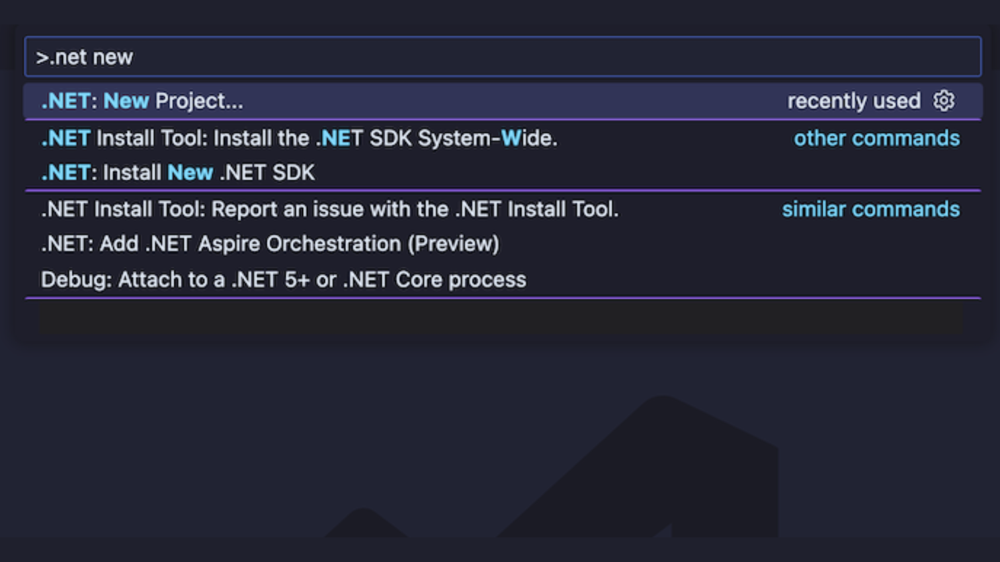
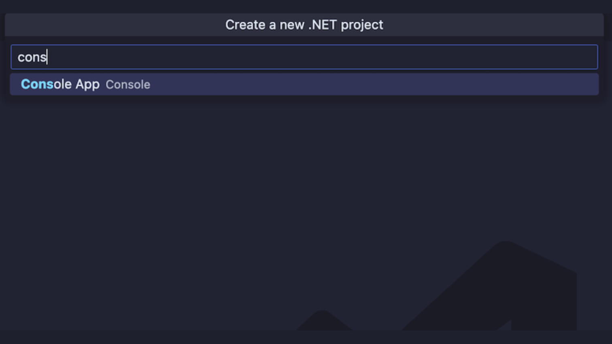
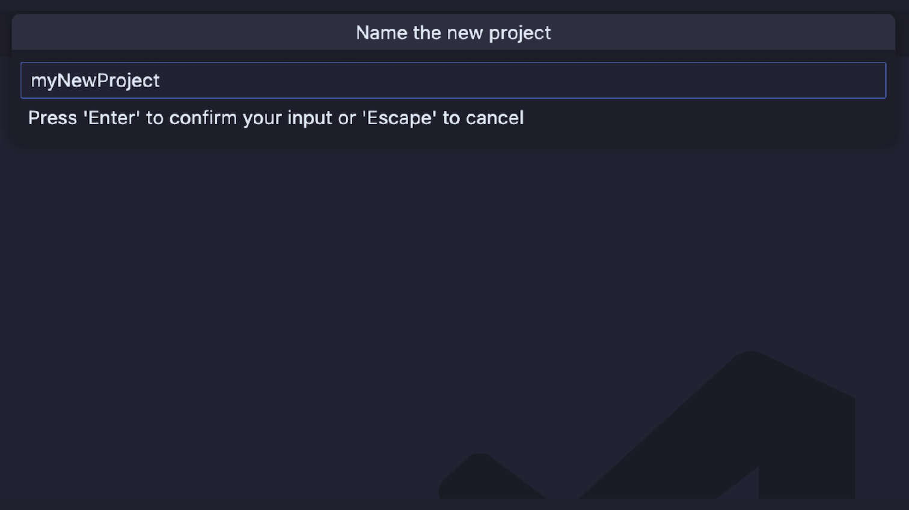
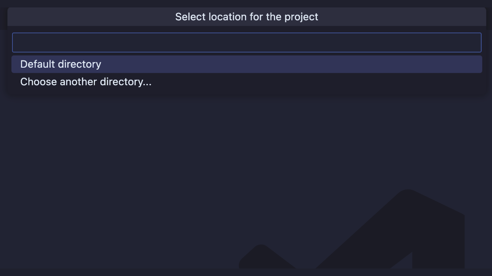
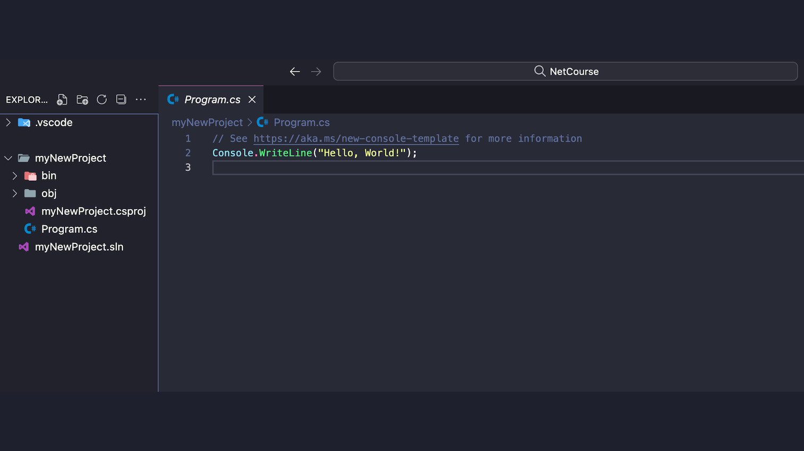
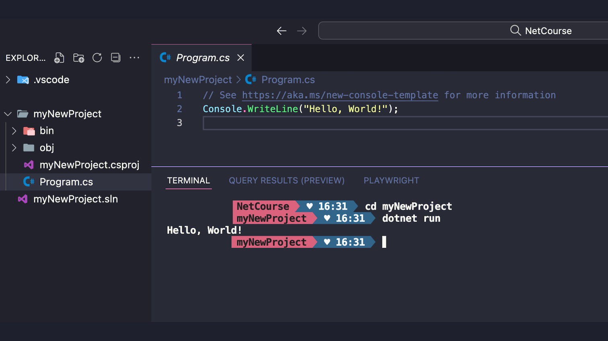

# Unidad 1: Fundamentos de .NET y C#
## Tema 1: Introducción a .NET y C#

> [Back to Menu](../../README.md)

## ST1. Conceptos Básicos de .NET y Su Entorno

### ¿Qué es .NET y por qué deberías conocerlo?

.NET, en su esencia, es mucho más que un simple framework; es una plataforma de desarrollo robusta, versátil y open-source creada por Microsoft. Imagina un universo donde puedes construir prácticamente cualquier tipo de aplicación: desde aplicaciones web de alto rendimiento y APIs RESTFul, pasando por aplicaciones móviles multiplataforma, hasta llegar a juegos, servicios en la nube y mucho más. ¡Ese es el poder de .NET!

La plataforma proporciona un entorno de ejecución que soporta múltiples lenguajes de programación y una rica biblioteca de clases que facilita el desarrollo de software. Además, se puede utilizar en diferentes sistemas operativos, lo que lo convierte en una opción versátil para el desarrollo moderno.

Desde su nacimiento, .NET ha evolucionado constantemente, y hoy, con versiones como .NET 8.0 y superiores, estamos ante una tecnología open-source, multiplataforma (Windows, macOS, Linux) y con un rendimiento excepcional. Esto significa que no solo aprenderás una tecnología de punta, sino que también podrás aplicar tus conocimientos en una amplia gama de entornos y sistemas operativos.

### Componentes clave del entorno .NET

#### Para entender mejor cómo funciona .NET, es crucial conocer sus componentes principales


> * **CLR (Common Language Runtime):** El Corazón de .NET. Piensa en el CLR como el motor que impulsa tus aplicaciones .NET. Es un entorno de ejecución gestionado que se encarga de tareas esenciales como la gestión de memoria, la seguridad, el manejo de excepciones y la compilación Just-In-Time (JIT). El CLR permite que el código escrito en diferentes lenguajes .NET (como C#, F#, Visual Basic) se ejecuten juntos sin problemas.
>
> * **BCL (Base Class Library) o Framework Class Library (FCL):** Tu Caja de Herramientas Esencial. La BCL es una enorme biblioteca de clases, interfaces y tipos de valor que te proporciona funcionalidades pre-construidas para casi cualquier cosa que puedas imaginar. Desde operaciones básicas como manejo de strings, colecciones y archivos, hasta funcionalidades más complejas como redes, seguridad, XML, y acceso a bases de datos. ¡La BCL te ahorra muchísimo tiempo y esfuerzo!
>
>* **Lenguajes .NET:** Un Universo de Opciones. Aunque este curso se centra en C#, .NET soporta múltiples lenguajes. Esta interoperabilidad es una de las grandes fortalezas de .NET. Los lenguajes más populares son:
>
>   * **C# (C Sharp):** El lenguaje principal y más popular para .NET. Es un lenguaje moderno, elegante, orientado a objetos y con una sintaxis clara que facilita la productividad. ¡Es el lenguaje que usaremos principalmente en este curso!
>
>   * **F# (F Sharp):** Un lenguaje funcional poderoso y conciso, ideal para análisis de datos, computación científica y programación concurrente.
>
>   * **Visual Basic .NET (VB.NET):** Una evolución del clásico Visual Basic, útil para desarrollo rápido de aplicaciones, aunque menos común en el backend moderno comparado con C#.
>
>* **.NET SDK (Software Development Kit):** Tu Kit de Desarrollo Completo. El SDK incluye herramientas y librerías esenciales para desarrollar, construir, ejecutar y publicar aplicaciones .NET. Dentro del SDK encontrarás el compilador de C# (Roslyn), las herramientas de línea de comandos (.NET CLI), y las librerías base.
>
>* **.NET Runtime:** El Entorno de Ejecución. El Runtime es el componente necesario para ejecutar aplicaciones .NET ya compiladas. Si solo necesitas ejecutar aplicaciones .NET, y no desarrollarlas, solo necesitas el Runtime.


### ¿Por qué .NET 8.0 en adelante?

Trabajaremos con .NET 8.0 o versiones posteriores porque representan la última generación de .NET, con mejoras significativas en rendimiento, nuevas características del lenguaje C# y una mayor estabilidad. Aprender con la versión más reciente te asegura estar al día con las prácticas modernas de desarrollo y aprovechar las últimas innovaciones de la plataforma.
___

> [Back to Menu](../../README.md)

## ST2. Configuración del Entorno con vsCode

¡Vamos a poner manos a la obra! Para desarrollar en .NET con C#, necesitaremos un entorno de desarrollo integrado (IDE). Aunque existen varias opciones (como Visual Studio, que es muy completo pero solo para Windows), nosotros vamos a usar Visual Studio Code (vsCode). 

### ¿Por qué VS Code?

>* **Multiplataforma:** Funciona genial en Windows, macOS y Linux.
>
>* **Ligero y Rápido:** Consume menos recursos que IDEs más pesados, ideal para cualquier máquina.
>
>* **Extensible:** Puedes personalizarlo con extensiones para prácticamente cualquier lenguaje y tecnología.
>
>* **Gratuito:** ¡Es totalmente gratuito y open-source!
>
>* **Excelente Soporte para C# y .NET:** Gracias a las extensiones de Microsoft.

### Pasos para configurar tu Entorno con VS Code

#### 1. Instala tu entorno de desarrollo

* Instala el .NET SDK [(Software Development Kit)](https://dotnet.microsoft.com/download)

* Descarga el SDK de .NET (la versión más reciente) que corresponda a tu sistema operativo (Windows, macOS o Linux).

* El SDK incluye todo lo necesario para desarrollar y ejecutar aplicaciones .NET.

* Ejecuta el instalador y sigue los pasos. Asegúrate de reiniciar tu terminal o consola después de la instalación para que los cambios en las variables de entorno se apliquen correctamente.

#### 2. Instala Visual Studio Code (VS Code)

* Ve al sitio oficial de [VS Code](https://code.visualstudio.com/)

* Descarga la versión para tu sistema operativo.

* Ejecuta el instalador y sigue los pasos.

#### 3. Instala la Extensión C# para VS Code

* Abre VS Code.

* Ve al menú Extensiones (icono cuadrado en la barra lateral izquierda, o presiona `Ctrl+Shift+X` o `Cmd+Shift+X` en macOS).

* Busca `C#` en el buscador de extensiones.

* Instala las extensiones: `.NET Install Tool`, `C# by Microsoft`, `IntelliCode for C# Dev Kit by Microsoft` y `C# Dev Kit by Microsoft`. Estas extensiones te proporcionarán soporte de lenguaje C#, como IntelliSense (autocompletado inteligente), depuración, refactorización y más.

#### 4. Verifica las Instalaciones

* Abre una nueva terminal en VS Code (menú Terminal -> Nueva Terminal).

* Escribe el comando `dotnet --version` y presiona Enter.

* Deberías ver la versión del .NET SDK instalada (por ejemplo, 8.0.x). Si ves un error, revisa que hayas reiniciado la terminal después de instalar el SDK o repasa los pasos de instalación.

¡Felicidades! Tu entorno .NET con C# y VS Code está listo para empezar a programar. Ahora, ¡PONGÁMOSLO A PRUEBA!
___
### Tu primer proyecto de .Net

> Abre la Paleta de Comandos de vsCode: Presiona el comando correspondiente a tu SO o directamente en la barra de búsqueda que podrás ver en la parte superior de vsCode escribe el símbolo `>` Este símbolo nos ayuda a generar comandos que ejecutan librerías o nos dan funcionalidades extendidas en vsCode.
>
>   | Windows | MacOs | Otros |
>   |:-------:|:-----:|:-----:|
>   | `Ctrl+Shift+P` | `Cmd+Shift+P` | `> en la barra de búsqueda`|
>
>---
>* Escribe ```.NET: New Project``` y selecciónalo (o simplemente empieza a escribir ```.NET``` y aparecerá en la lista).
>
><center></center>
>
>---
>* Selecciona el tipo de proyecto ```Console App```.
>
><center></center>
>
>---
>* Escribe un nombre para tu proyecto (por ejemplo, ```myNewProject```) y presiona Enter.
>
><center></center>
>
>---
>* Elige una ubicación para guardar tu proyecto (por ejemplo, tu carpeta de repositorios locales).
>
><center></center>
>
>---
>* VS Code creará una carpeta con tu proyecto y abrirá los archivos necesarios. Verás un archivo llamado ```Program.cs``` que contiene el código de ```myNewProject```.
>
><center></center>
>
>---
>* Abre la terminal integrada de vsCode ```Terminal -> New Terminal```. Navega a la carpeta de tu proyecto usando el comando ```cd NombreDeTuProyecto```, luego el comando ```dotnet run``` y presiona Enter.
>
><center></center>
>
><center><h2>¡Deberías ver el mismo mensaje <code>"Hello, World!"</code> impreso en la terminal! 
>
>¡Has creado y ejecutado tu primer programa .NET en vsCode!</h2></center>

---
> [Back to Menu](../../README.md)

## ST3. Introducción a C#

Estructura básica, tipos de datos, variables, operadores

### Estructura Básica de un Programa en C#

Un programa en C# se organiza de la siguiente manera:

> * Namespaces (Espacios de Nombres): Sirven para organizar el código y evitar colisiones de nombres. Piensa en ellos como "apellidos" para tus clases. Usamos la palabra clave namespace para definirlos. Se asemejan a los paquetes te Java.
>
> * Classes (Clases): Son los bloques de construcción fundamentales en la programación orientada a objetos. Las clases contienen datos (campos) y acciones (métodos). Usamos la palabra clave class para definirlas.
>
> * Methods (Métodos): Son bloques de código que realizan tareas específicas. El método `Main` es el punto de entrada de tu programa, donde la ejecución comienza.

### Tipos de Datos Fundamentales en C#

C# es un lenguaje fuertemente tipado, lo que significa que debes declarar el tipo de dato de cada variable antes de usarla. Esto ayuda a prevenir errores y hace que el código sea más legible y mantenible. Aquí tienes algunos de los tipos de datos más comunes:

>#### Tipos de Valor (Value Types): Almacenan el valor directamente en la memoria.
>
>
> **Numéricos:**
> 
> * int: Enteros (ej: 10, -5, 0).
> 
> * long: Enteros más grandes (ej: 10000000000L).
> 
> * float: Números de punto flotante de precisión simple (ej: 3.14f). Nota la f al final.
> 
> * double: Números de punto flotante de doble precisión (ej: 3.14159). Es el tipo por defecto para números decimales.
> 
> * decimal: Números decimales de alta precisión, ideales para cálculos financieros (ej: 12.99m). Nota la m al final.
> 
> * bool: Valores booleanos (true o false).
> 
> * char: Caracteres individuales (ej: 'A', '%').
> 
> * struct y enum: Tipos de valor definidos por el usuario (los veremos más adelante).
>
>
>#### Tipos de Referencia (Reference Types): Almacenan una referencia (dirección de memoria) al valor.
>
>
> * string: Cadenas de texto (ej: "Hola Mundo"). Aunque string es un tipo de referencia, C# lo trata de manera especial en muchos aspectos, haciéndolo similar a un tipo de valoren su >uso común.
> 
> * object: La clase base de todos los tipos en .NET. Puede referenciar cualquier tipo de objeto.
> 
> * class: Tipos definidos por el usuario (como Program en nuestro ejemplo).
> 
> * interface, delegate, array: Otros tipos de referencia que exploraremos más adelante.
>
>

### Variables en C#

Una variable es un nombre que se asocia a una ubicación de memoria donde puedes almacenar un valor. Para declarar una variable en C#, debes especificar su tipo y su nombre.

> Sintaxis de Declaración de Variables
> ```pseudo
> tipo nombreVariable; // Declaración (sin inicializar)
> tipo nombreVariable = valor; // Declaración e inicialización
> ```

> Ejemplos de Declaración de Variables
> ```csharp
> int edad; // Declaramos una variable entera llamada edad
> edad = 30; // Asignamos el valor 30 a la variable edad
> 
> string nombre = "Juan"; // Declaramos e inicializamos una variable string llamada nombre
> 
> double precio = 99.99; // Declaramos e inicializamos una variable double llamada precio
> 
> bool esValido = true; // Declaramos e inicializamos una variable bool llamada esValido
> ```

### Operadores en C#

Los operadores te permiten realizar operaciones con variables y valores. C# soporta una amplia gama de operadores, similares a los de Java y otros lenguajes:

>|Operadores Aritméticos|Operadores de Asignación|Operadores de Comparación|Operadores Lógicos|Operadores a Nivel de Bits|
>|---|---|---|---|---|
>|\+ (suma)|= (asignación simple)|== (igualdad)|&& (AND lógico)|& (AND bit a bit)|
>|\- (resta)|+= (suma y asignación)|!= (desigualdad)| \|\| (OR lógico)|\| (OR bit a bit)|
>|\* (multiplicación)|-= (resta y asignación)|\> (mayor que)|! (NOT lógico). Se usan para combinar expresiones booleanas|^ (XOR bit a bit)|
>|\/ (división)|*=, /=, %= (similares para multiplicación, división y módulo)|< (menor que)||~ (complemento a uno)|
>|\% (módulo - resto de la división)||\>= (mayor o igual que)||<< (desplazamiento a la izquierda)|
>|\++ (incremento)||<= (menor o igual que). Estos operadores devuelven un valor bool (true o false)||\>> (desplazamiento a la derecha). Menos comunes en backend, pero útiles en ciertas >situaciones|
>|\-- (decremento)|||||

#### Ejemplos de Operadores en Acción

```csharp
int numero1 = 10;
int numero2 = 5;

int suma = numero1 + numero2; // suma = 15
int resta = numero1 - numero2; // resta = 5
int producto = numero1 * numero2; // producto = 50
int division = numero1 / numero2; // division = 2
int modulo = numero1 % numero2; // modulo = 0

bool esMayor = numero1 > numero2; // esMayor = true
bool sonIguales = numero1 == numero2; // sonIguales = false

bool resultadoLogico = esMayor && !sonIguales; // resultadoLogico = true (true AND NOT false)
```
___

> [Back to Menu](../../README.md)

## ST4. Niveles de Acceso

Los **niveles de acceso**, también conocidos como **modificadores de acceso**, son palabras clave en C# que te permiten **controlar la visibilidad y accesibilidad** de los miembros de una clase (campos, métodos, propiedades, etc.) y de las propias clases. En otras palabras, definen **quién puede ver y usar** cada parte de tu código. Esto es fundamental para la **encapsulación y la seguridad** en la programación orientada a objetos.

>C# proporciona los siguientes niveles de acceso principales
>
>
>
>* public: Accesible desde cualquier lugar, tanto dentro como fuera de la clase, dentro del mismo proyecto o desde otros proyectos que referencien tu proyecto. Es el nivel de acceso más permisivo.
>
>* private: Accesible solo desde dentro de la misma clase donde se declara el miembro. Ni siquiera las clases derivadas (herencia) pueden acceder a miembros privados de la clase base. Es el nivel de acceso más restrictivo. Esencial para la encapsulación y ocultar la implementación interna.
>
>* protected: Accesible desde la clase donde se declara y desde las clases derivadas (herencia), incluso si las clases derivadas están en otros proyectos. Permite compartir implementación entre una jerarquía de clases, pero oculta la implementación al resto del mundo exterior.
>
>* internal: Accesible desde cualquier código dentro del mismo ensamblado (proyecto). Un ensamblado es, en términos simples, tu proyecto compilado (un archivo .dll o .exe). Si tu código está en el mismo proyecto, puede acceder a miembros internal, pero si está en un proyecto diferente, no puede. Útil para ocultar detalles de implementación dentro de un proyecto, pero compartirlos entre las partes del mismo proyecto.
>
>* protected internal: Una combinación de protected e internal. Es accesible desde la clase actual, clases derivadas o cualquier código dentro del mismo ensamblado. Es menos común, pero ofrece flexibilidad.
>
>* file: Accesible solo dentro del mismo archivo. Introducido en versiones recientes de C#. Permite limitar el alcance de un miembro a un único archivo, útil para organización y evitar conflictos en archivos grandes.
>
>* private protected: Accesible solo dentro de la clase contenedora o tipos derivados dentro del mismo ensamblado. Restringe el acceso a clases derivadas solo si están dentro del mismo proyecto.
>
>

### Veamos algunos ejemplos prácticos de niveles de acceso

> Imaginemos que estamos modelando una clase [CuentaBancaria](https://gist.github.com/appitoriadev/c57752d1f1ed8121791e38dbf9b046c4)


```csharp
public class CuentaBancaria
{
    public string NumeroCuenta { get; } // Propiedad pública para obtener el número de cuenta (solo lectura)
    private decimal saldo; // Campo privado para el saldo, solo accesible dentro de la clase
    protected string titular; // Campo protegido para el titular, accesible en la clase y derivadas
    internal string codigoBancoInterno; // Campo internal, visible solo dentro del proyecto bancario

    public CuentaBancaria(string numeroCuenta, string titularInicial)
    {
        NumeroCuenta = numeroCuenta;
        this.titular = titularInicial;
        this.saldo = 0; // Saldo inicial es 0
        this.codigoBancoInterno = "BancoXYZ-InternalCode-123"; // Código interno del banco
    }

    public void Depositar(decimal cantidad) // Método público para depositar
    {
        if (cantidad > 0)
        {
            saldo += cantidad; // Modificamos el saldo (campo privado) dentro de la clase
            Console.WriteLine($"Depósito de {cantidad} realizado. Saldo actual: {saldo}");
        }
        else
        {
            Console.WriteLine("La cantidad a depositar debe ser positiva.");
        }
    }

    public bool Retirar(decimal cantidad) // Método público para retirar
    {
        if (cantidad > 0 && saldo >= cantidad)
        {
            saldo -= cantidad; // Modificamos el saldo (campo privado) dentro de la clase
            Console.WriteLine($"Retiro de {cantidad} realizado. Saldo actual: {saldo}");
            return true; // Retiro exitoso
        }
        else
        {
            Console.WriteLine("Saldo insuficiente o cantidad inválida para retiro.");
            return false; // Retiro fallido
        }
    }

    // Método interno, solo para uso dentro del proyecto bancario
    internal void ImprimirDetallesInternos()
    {
        Console.WriteLine($"Detalles Internos de la Cuenta (uso interno del banco):");
        Console.WriteLine($"Número de Cuenta: {NumeroCuenta}"); // Público
        Console.WriteLine($"Saldo (interno): {saldo}"); // Privado, pero accesible desde dentro de la clase
        Console.WriteLine($"Titular (protegido, interno): {titular}"); // Protegido, accesible desde la clase
        Console.WriteLine($"Código Banco Interno (internal): {codigoBancoInterno}"); // Internal, accesible desde el proyecto
    }

    // Método protegido, solo para uso en clases derivadas (si tuviéramos herencia)
    protected void NotificarCambioSaldo(decimal saldoAnterior, decimal saldoActual)
    {
        Console.WriteLine($"[Notificación Interna - Clase Base]: Saldo de la cuenta ha cambiado de {saldoAnterior} a {saldoActual}.");
        // Aquí podríamos tener lógica para registrar el cambio, enviar alertas, etc.
    }


    // Ejemplo de uso de 'private protected' (requiere herencia y mismo proyecto)
    private protected decimal ObtenerSaldoProtegido()
    {
        return saldo;
    }
}

// Clase Derivada (en el mismo proyecto para ejemplo de 'protected' y 'private protected')
public class CuentaBancariaPremium : CuentaBancaria
{
    public CuentaBancariaPremium(string numeroCuenta, string titularInicial) : base(numeroCuenta, titularInicial)
    {
    }

    public void ImprimirSaldoProtegidoDesdeDerivada()
    {
        // Podemos acceder a 'titular' (protected) desde la clase derivada
        Console.WriteLine($"Titular de Cuenta Premium (desde clase derivada): {titular}");

        // Podemos acceder a 'ObtenerSaldoProtegido' (private protected) desde la clase derivada DENTRO DEL MISMO PROYECTO
        Console.WriteLine($"Saldo Protegido (desde clase derivada en mismo proyecto): {ObtenerSaldoProtegido()}");

        // NO podemos acceder directamente a 'saldo' (private) desde la clase derivada
        // (Intentar acceder a 'saldo' aquí daría error de compilación)
    }

    // Sobreescribimos el método NotificarCambioSaldo (protected)
    protected new void NotificarCambioSaldo(decimal saldoAnterior, decimal saldoActual)
    {
        base.NotificarCambioSaldo(saldoAnterior, saldoActual); // Llamamos a la implementación de la clase base
        Console.WriteLine($"[Notificación Extendida - Clase Premium]: Cambio de saldo con detalles adicionales para cuenta Premium.");
        // Lógica adicional específica para cuentas Premium
    }

    public new bool Retirar(decimal cantidad) // Ejemplo de 'new' para ocultar método de la clase base (mala práctica en herencia)
    {
        if (cantidad <= 0) return false;

        decimal saldoAnterior = ObtenerSaldoProtegido(); // Usamos 'private protected' aquí (accesible en derivadas del mismo proyecto)
        if (saldoAnterior >= cantidad * 1.1m) // Permitimos sobregiro del 10% en cuentas premium
        {
            saldo -= cantidad; // Accedemos a 'saldo' de la clase base (aunque sea privado, ¡estamos dentro!)
            NotificarCambioSaldo(saldoAnterior, saldo - cantidad); // Llamamos al método protegido (sobrescrito en esta clase)
            Console.WriteLine($"[Cuenta Premium] Retiro de {cantidad} realizado con sobregiro permitido. Saldo actual: {saldo}");
            return true;
        }
        else
        {
            Console.WriteLine("[Cuenta Premium] Saldo insuficiente incluso con sobregiro permitido.");
            return false;
        }
    }

}

public class EjemploNivelesAcceso
{
    public static void Main(string[] args)
    {
        CuentaBancaria cuenta = new CuentaBancaria("123456789", "Juan Perez");

        // Acceso a miembros PUBLIC:
        Console.WriteLine($"Número de Cuenta (público): {cuenta.NumeroCuenta}"); // OK: Público, accesible desde cualquier lugar
        cuenta.Depositar(100); // OK: Método público
        cuenta.Retirar(50);    // OK: Método público

        // NO podemos acceder a miembros PRIVATE directamente desde fuera de la clase:
        // Console.WriteLine($"Saldo (privado): {cuenta.saldo}"); // Error: 'saldo' es inaccesible debido a su nivel de protección
        // cuenta.saldo = 1000; // Error: 'saldo' es inaccesible debido a su nivel de protección

        // NO podemos acceder a miembros PROTECTED directamente desde fuera de la jerarquía de herencia (no somos clase derivada):
        // Console.WriteLine($"Titular (protegido): {cuenta.titular}"); // Error: 'titular' es inaccesible debido a su nivel de protección

        // NO podemos acceder a miembros INTERNAL directamente desde OTRO PROYECTO (si este código estuviera en otro proyecto):
        // Console.WriteLine($"Código Banco Interno (internal): {cuenta.codigoBancoInterno}"); // Error: 'codigoBancoInterno' es inaccesible debido a su nivel de protección

        // Accedemos a método INTERNAL desde DENTRO DEL MISMO PROYECTO:
        cuenta.ImprimirDetallesInternos(); // OK: 'ImprimirDetallesInternos' es internal, y estamos en el mismo proyecto

        Console.WriteLine("\nEjemplo con Cuenta Premium (clase derivada):");
        CuentaBancariaPremium cuentaPremium = new CuentaBancariaPremium("987654321", "Maria Rodriguez");
        cuentaPremium.Depositar(200);
        cuentaPremium.Retirar(250); // Retiro con sobregiro en cuenta Premium
        cuentaPremium.ImprimirSaldoProtegidoDesdeDerivada(); // Demostración de acceso 'protected' y 'private protected' en derivadas del mismo proyecto.

        // Ejemplo de acceso 'file' (requiere crear un miembro 'file' en alguna clase y tratar de acceder desde otro archivo - omitido por brevedad)
        // Ejemplo de acceso 'private protected' (ya demostrado con ObtenerSaldoProtegido en CuentaBancariaPremium)
    }
}
```


### Puntos Clave sobre Niveles de Acceso:
>* **Encapsulación:** Los niveles de acceso son esenciales para la encapsulación, uno de los pilares de la POO. Permiten **ocultar los detalles internos** de una clase y exponer solo una **interfaz pública bien definida.** Esto hace que el código sea más **modular, robusto y fácil de mantener.**
>
>* **Seguridad:** Al controlar el acceso, puedes **prevenir modificaciones accidentales o maliciosas** al estado interno de tus objetos. Por ejemplo, el `saldo` de una cuenta bancaria debería ser privado y solo modificarse a través de métodos controlados como `Depositar y Retirar`.
>
>* **Legibilidad y Mantenibilidad:** Usar niveles de acceso de forma adecuada hace que el código sea **más fácil de entender y mantener a largo plazo**. Indica claramente qué partes de una clase están pensadas para ser usadas desde fuera y cuáles son solo para uso interno.
>
>* **Principio de Mínima Exposición (Least Privilege):** En general, es una buena práctica usar el **nivel de acceso más restrictivo posible** que aún permita que tu código funcione correctamente. Empieza con `private` y luego ve ampliando el acceso solo cuando sea necesario.

<center><code>Entendemos que no todo el código generado hasta ahora te hace sentido en este momento de tu camino, pero profundizaremos en estos temas más adelante.</code>

<h3>Hemos cubierto los fundamentos de .NET y C#, desde sus componentes clave hasta la estructura básica de C#, tipos de datos, operadores, configuración del entorno de desarrollo con vsCode y los cruciales niveles de acceso. Descubriremos mucho más, como arquitecturas, modelado de bases de datos con Entity Framework, testing y muchos temas más. ¡Estás listo para seguir explorando el fascinante mundo de .NET! ¡Prepárate para construir código más organizado, reutilizable y poderoso!</h3></center>


> [Back to Menu](../../README.md)